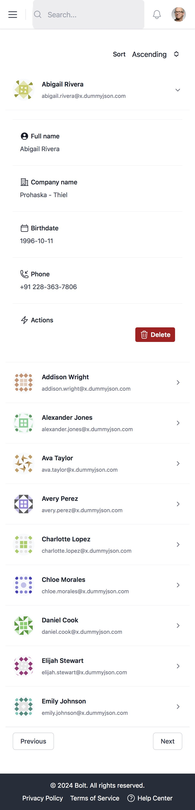
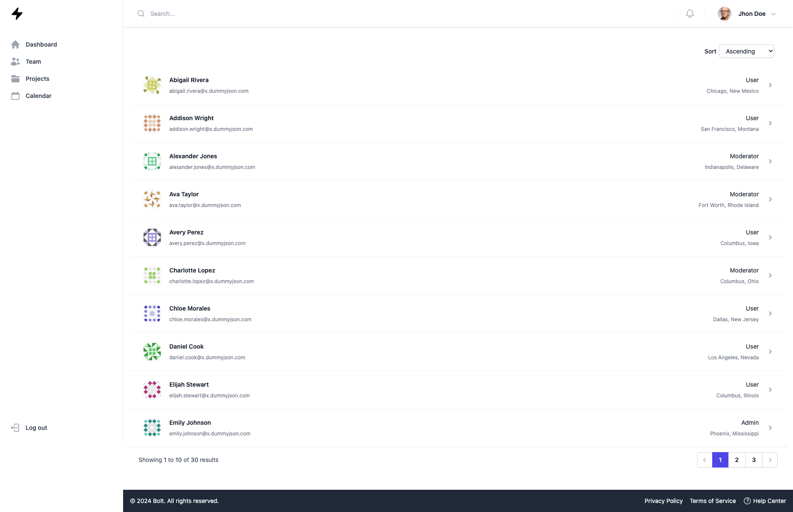

# React + TypeScript + Vite

This template provides a minimal setup to get React working in Vite with HMR and some ESLint rules.

Currently, two official plugins are available:

- [@vitejs/plugin-react](https://github.com/vitejs/vite-plugin-react/blob/main/packages/plugin-react/README.md) uses [Babel](https://babeljs.io/) for Fast Refresh
- [@vitejs/plugin-react-swc](https://github.com/vitejs/vite-plugin-react-swc) uses [SWC](https://swc.rs/) for Fast Refresh

## Overview

### Screenshot(s)

<figure>
  
  <figcaption>Mobile version</figcaption>
</figure>

<figure>
  
  <figcaption>Desktop version</figcaption>
</figure>

### Links

- Live site URL: [Github Pages](https://alonsovzqz.github.io/react-challenge/)

## My process

### Built with

- [React](https://react.dev/)
- [Typescript](https://www.typescriptlang.org/)
- [Vite](https://vite.dev/)
- [Axios](https://axios-http.com/docs/intro)
- [React Query](https://tanstack.com/query/v3)
- [Hero Icons](https://heroicons.com/)
- [Tailwind CSS](https://tailwindui.com/)

### About

To create this I tried to follow the instructions and the mockup presented for this challenge.

The approach was to basically create a small functional dashboard using the Atomic Design Methodology since I think it provides a way to keep consistency thru the components and makes them more reusable on the entire application.

I created what I thought was the basic smaller components (didn't want to create for example a link component since I think that for this challenge would add a lot of unnecessary verbosity).

I like to keep things separated to make the code clearer, readable and easier to understand, that's why I decided to keep all the types from the components in a separate `types` folder, that way I just import the types and keep the component clearer and focus on what matter most.

### The API

Given the challenge I started to look for some public APIs. And I started with the `jsonplaceholder` user's API but I realized that it only had like 10 users, so, that wouldn't help much with the purpose of the challenge (since I needed more than 10 users in order to make use of the pagination component) and decided to go with a different one.

On the types I created for the response back from the API I didn't list all the information from it, simply because I think it was too much innecessary information and just decided to put only that info that seemed relevant.

With DELETE a user from that API it actually (for obvious reasons) does not remove the user from the server itself, it actually just returns the same response but with two additional properties to the specified "deleted" item (`isDeleted` and `deletedOn`), for that reason I went for something more "practical" like just filtering the results instead of making a call and get the same data once more. But that's something that could be done quite easily.

### What could be improved?

There are a ton of things to improve since this project was created in a rush. 

- First of all, the sidebar does not work on mobile, since it doesn't have any functionality at all (like actual functionality like take the user to another page or actually log out the user).
- The user button (Jhon Doe) does not have any functionality, in a ideal scenario it could bring a menu when the user clicks on it and display some options (like Settings and Log Out for example)
- The select component needs improvement like remove the browser styles and give it a complete custom style. The options as well could be using custom styles and also even add the feature to add icons to the options, select multiple values, etc.
- The sort logic could go way beyond to just sort ascending/descending order by `firstName` it could have options to sort by city, email, even role.
- The pagination it's very simple, It could be extended to allow the user to select how many users per page wanted to see. Also when clicking on the page numbers it could be to trigger another call to the API to get more users.